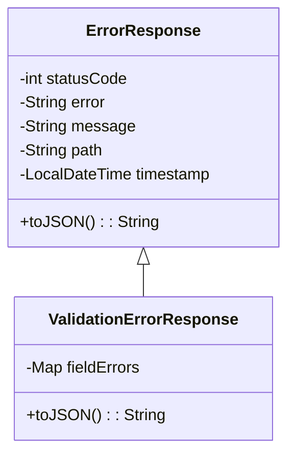

## Daily-sentence

### 개요

영어학습을위한 매일 영어 한문장과 관련 유튜브 쇼츠 영상을 제공하고 이메일 구독을 통한 1주일간의 정보를 제공하는 뉴스레터 기능을 제공하는 프로젝트 입니다.

### 프로젝트 목표

시장 반응을 빠르게 확인하기 위해 최소 기능 제품(MVP)을 빠르게 개발·출시하고, 여러곳에 개별적인 홍보링크를 통해서 유입된 퍼널(Funnel) 등이 어떤 경로에서 유입 되었는지, 이탈율은 어떻게 되는지를 추적하고 이를 개선 해나가고 CTA(Call to Action)을 통해 구독율을 증가 시키기 위한 프로젝트 입니다.

- [📂 Front Repository](https://github.com/yanggwangseong/daily-sentence-fe)

## 해당 기술이 왜 필요한지 어떤 문제를 해결하기 위해서 사용 했는지에 대해서 고민 하였습니다.

- [Layered Architecture가 왜 중요할까?](https://github.com/yanggwangseong/daily-sentence-be)
- [Date 타입은 왜 불변성을 보장 해야 할까?](https://github.com/yanggwangseong/daily-sentence-be)
- [Try Catch와 Response Type](https://github.com/yanggwangseong/daily-sentence-be)
- [왜 Memcached를 선택 했을까?](https://github.com/yanggwangseong/daily-sentence-be)

## SES를 통한 이메일 전송 Lambda 함수

- [📝 AWS SES EventBridge Lambda를 이용한 이메일 전송](https://yokan.netlify.app/aws/ses-eventbridge-lambda%EB%A5%BC%20%EC%9D%B4%EC%9A%A9%ED%95%9C%20%EB%A9%94%EC%9D%BC%EB%A7%81)
- [📂 Lambda Repository](https://github.com/yanggwangseong/daily-sentence-lambda-ses)

## AWS Infra

### InfraStructure

  

---

### CI/CD

  

---

### EventBridge Lambda SES

  

## Code Convention with Auto-formatting

- Git Hook기반의 Husky를 활용한 prettier, eslint, Unit Test 자동화
- prepare-commit-msg를 활용한 issue 번호 또는 티켓 번호를 커밋 메세지에 자동 삽입
- github actions를 활용한 PR생성시 Unit Test 및 E2E 테스트 자동화

[Auto Test & Auto Code Convention and Formatting](https://github.com/yanggwangseong/daily-sentence-be/wiki/Auto-Test-&-Auto-Code-Convention-and-Formatting)

## Code Quality

- github actions를 활용한 PR 생성시 code coverage 자동 comment
      

      

      

- github actions와 SonarCloud를 활용한 코드 정적 분석
    

    

    

### 코드 정적 분석을 통한 코드 퀄리티 개선

초기 프로젝트 정적 분석 결과

  

- 관련 PR[github pr 링크]

**Severity(심각도)**

- High : 1
- Medium : 1
- Low : 8

**Code Smell**

#### 개선후

- 10

## Layered Architecture

## Response Class

## Articles

- [AWS SES EventBridge Lambda를 이용한 메일링](https://yokan.netlify.app/aws/ses-eventbridge-lambda%EB%A5%BC%20%EC%9D%B4%EC%9A%A9%ED%95%9C%20%EB%A9%94%EC%9D%BC%EB%A7%81)
- [AWS CloudFront Geo-location](https://yokan.netlify.app/aws/aws%20cloudfront%20geo-location)

## Git Branch Strategy & Commit Convention

**Git-Flow**

  

**Commit Convention**
